# IDE Getting Started


## Core Concepts

The core abstraction is the hierarchical block diagram, which we will explain using an example design of a microcontroller driving an LED.

In conventional schematic tools, such a design could be a flat schematic, consisting of the microcontroller module, LED, and resistor:


Many modern tools have the concept of hierarchy blocks, where a block could be a subcircuit:

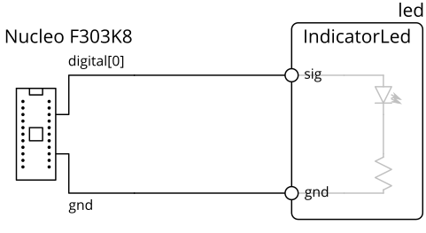

In this example, the LED-resistor subcircuit is contained within a block, which can be manipulated as a unit, and exposes ports (circles on the diagram) while encapsulating internal pins.
(note: in tools with this feature, the subcircuit is usually presented in its own sheet, instead of having its contents displayed in the block)

Generalizing this model, components are blocks too, and component pins are also block ports:

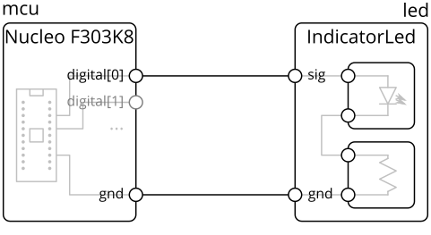

The main concepts our model extends on top of the simple hierarchy blocks above are **parameters**, **links**, and **generators**.

**Parameters** are variables that can be attached to blocks and ports.
For example, a digital IO, like `digital[0]` in the example above, would have parameters like input voltage tolerance, output voltage range, and logic thresholds.
This allows for a more powerful design correctness check (think ERC++), and provides a foundation for generators.

**Links** are connections between ports, which defines how parameters propagate between those ports and any constraints on them.
Continuing the digital IO example, the link would check the output thresholds against the input thresholds, and provide the worst-case voltage levels given all connected drivers.
These could be viewed as a block-like object (diamonds on the diagram) instead of direct wire connections:

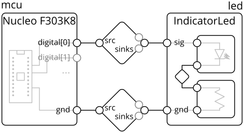

> In the design model, links are inferred based on the types of connected ports and not explicit.

Finally, **generators** allow a block's internal contents to be automatically and dynamically constructed, possibly based on parameters on it and its ports.
For example, the `IndicatorLed` block might automatically size the resistor based on the input voltage on the `sig` pin, or a DC-DC converter block might automatically size inductors and capacitors based on the expected output voltage and current.

In this tutorial, you'll be building a slightly different version of the above circuit, using a discrete microcontroller and adding additional parts.
Diagrams in the IDE will also look different than the manually drawn diagrams above.
For example, the equivalent of the above in the IDE would be:

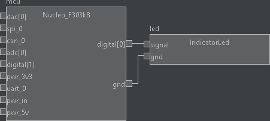


### Hardware Description Language (HDL)
To support user-defined computation of parameters and generator blocks, the design system is implemented as a _hardware description language_ (HDL).
That is, blocks are "placed" or instantiated, and their ports are connected, through lines in code instead of GUI actions in a graphical schematic.

There are a couple of basic operations, which you'll get to try in the tutorial:
- **Block Instantiation**: creates a sub-block in the current block
  - For example, `self.led = self.Block(IndicatorLed())` instantiates a `IndicatorLed` block and names it `led` in the current block
- **Port Instantiation**: creates an exterior port in the current block, used for building library blocks.
  - For example, `self.vdd = self.Port(VoltageSink(voltage_limits=(2.3, 5.5)*Volt, current_draw=(0, 15)*uAmp))` instantiates a port of type `VoltageSink` (voltage input) with defined voltage limits and current draw ranges, and names it `vdd`.
- **Connect**: connects two ports
  - For example, `self.connect(self.mcu.digital[0], self.led.signal)` connects a digital IO port on `mcu` to the signal port of `led`

### Graphical Editor and Integrated Development Environment (IDE)
While an HDL is needed to support parameter computation and programmatic construction, some operations (like building a top-level design with an LED connected to a microcontroller) may not require the full power provided by an HDL and may be more intuitive or familiar within a graphical environment.
However, because this design makes use of generator blocks (the LED), and because blocks may also take parameters (such as the target output voltage of a DC-DC converter), the HDL is still the primary design input. 

To help with these more basic operations and to support those more familiar with a graphical schematic capture flow, we provide an IDE to help bridge the graphical schematic-like and HDL code representations. Specifically, it:
- provides a block diagram visualization of the design
- allows inspection of solved / computed parameters in the design
- generates and inserts HDL code from schematic editor-like actions

In the rest of this tutorial, we'll cover IDE operations with an example project, then drop into HDL to build a custom part.


## IDE basics tutorial: Blinky

_In this example, we will create a circuit consisting of an LED and switch connected to a microcontroller._

Start by opening `blinky_skeleton.py`, which is pre-populated with this skeleton code:
```python
from edg import *


class BlinkyExample(SimpleBoardTop):
  def contents(self) -> None:
    super().contents()
    # your implementation here

    
if __name__ == "__main__":
  compile_board_inplace(BlinkyExample)
```

- `from edg import *` brings in the base classes for circuit construction, like `SimpleBoardTop` and the library parts we'll use in the rest of this tutorial.
- `class BlinkyExample` contains the (top-level) circuit you're going to build, and it extends the top-level board type `SimpleBoardTop`.
  It's empty for now, but we'll fill it in the next section.
- The stuff in `if __name__ == "__main__":` allows the design to compile (and generate netlists) by running the file.
  We won't be using this.

Your IDE should look something like this (minus the red annotation text):

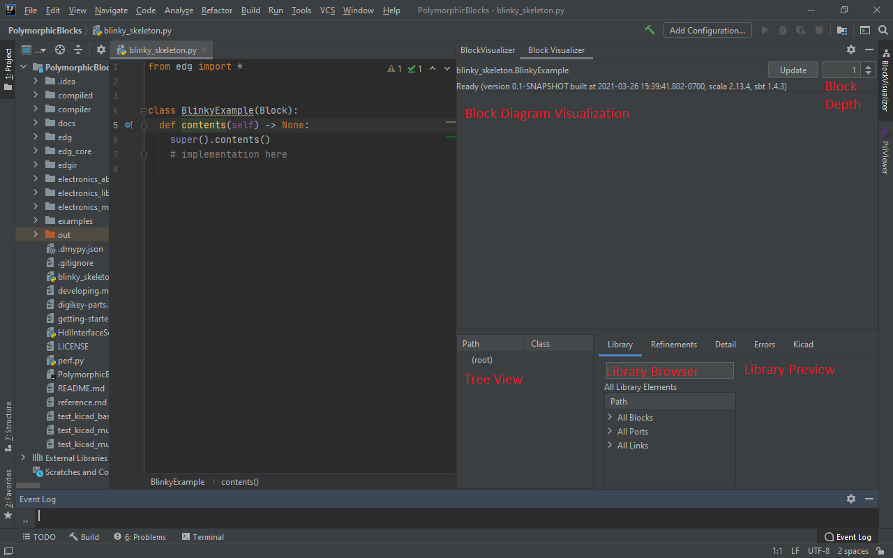

The major components are:
- **Block Diagram Visualization**: shows the compiled design visualized as a block diagram here.
  - **Tree View**: shows the compiled design as a tree structure of the block hierarchy.
- **Block Depth Selection**: selects the maximum depth of blocks shown in the Block Diagram Visualization. 1 means show only one level, 2 means show the top-level blocks and one level of internal blocks, and so on.  
- **Update Button**: click to re-compile and update the visualization. Also available through hotkey Ctrl + Alt + R.
- **Library Browser**: shows all the library blocks, ports, and links. The text box at the top allows filtering by keyword.
  - **Library Preview**: shows more information on the selected library block, including a docstring (if available)parameters, and block diagram preview.
  
We'll go over each in more detail as they are used.

### Hello, world
Let's start by compiling this (empty) design.
Select anywhere in the BlinkyExample class, then click on main menu > Tools > Set Visualizer Design.
Then, click on main menu > Tools > Refresh File (or Ctrl + Alt + R, or the update button on the Block Visualizer window) to compile.

As you might expect, you should get an empty design.

### Creating the microcontroller and LED
_In this section, you'll add and connect the microcontroller and LED blocks through GUI operations._

In the Library Browser search filter textbox, type in `microcontroller` to pre-filter the blocks.

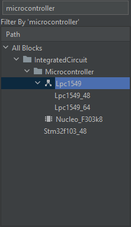

The icons have these meanings:
-  (category): this "block" is actually a category organizer and should not be instantiated.
-  (abstract type): this block is an abstract type.
  In most cases, it can be instantiated, but will need a choice of refinement ("concrete" subtype) before a design is complete.
  This is typically used for "jellybean" parts, to indicate that many parts can be used in place, depending on design requirements - such as surface-mount vs. through-hole.
-  (footprint): this block is a PCB footprint directly (as opposed to, for example, an application circuit which contains PCB footprints indirectly).
  In general, footprints are low-level constructs are should not be used where a non-footprint application circuit is also defined.
  But, in some cases, such as the Nucleo_F303k8, the footprint is the application circuit.
- Most will not have an icon, which means that they're none of the above.
  These blocks can be instantiated.

In the code editor, click at the end of `super().contents()` to set the caret position to insert code for a new block.
Then, double-click the Lpc1549_48 block in the library panel, give it a name (let's say, `mcu`), hit enter, and the relevant line of code should pop up.
The block should also appear on the visualization:

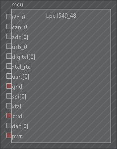

and the block instantiation line should appear in the code editor:

```python
self.mcu = self.Block(Lpc1549_48())
```

> In any IDE action where you double-click, you can also right-click to show other available actions.
> For actions that inserts code, double-clicking inserts code at the caret position, while right-clicking displays a list of other suggested places to insert code, such as the end of a function.

The hatched fill indicates that the block may be out-of-sync with the code until the next re-compile.
In this case, the **Lpc1549_48 block** is only a preview, while the enclosing BlinkyExample has been modified.

> While the insert action does some basic sanity checks (such as for syntax: it won't insert a `Block` call in a function call), it does not understand the context of where the code was inserted.
> For example, if you inserted the `Block` call within an `if` block, it will assume the `Block` call is run.
> Re-compiling will re-run the HDL and update the visualization to ground-truth.

The red boxes indicate a missing required connection, in this example including the power and ground pair, and the SWD programming line.

Then, repeat the above with an **IndicatorLed block**, and name it `led`.

### Connecting the microcontroller and LED
To start a connection operation on a port, double-click the port.
For example, to connect the LED to the microcontroller, double click on `mcu`'s `digital[0]` port:

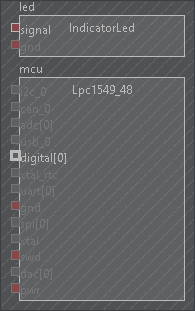

Then, select the ports to connect by clicking on them (in this case, `led`'s `signal` port), and double-click anywhere (within a block) to insert the connect code.
You can optionally give the new net a name, or leave it blank.
The new connection should show up on the visualizer:

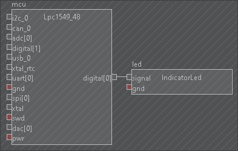

and the connect line should appear in the code editor:

```python
self.connect(self.mcu.digital[0], self.led.signal)
```

> You can cancel a connect action by double-clicking anywhere (within a block) without additional ports selected, or through the right-click menu regardless of whether ports are selected.

> Note that the connect statement is ordered with the starting item first, then the rest in order.
> Stylistically, we prefer sources before sinks, defined loosely (such as dataflow or power flow notations).
> This convention is also used by the block diagram visualizer to define an order where it isn't apparent from the port types, for example if two bidirectional digital ports are connected together, as opposed to a digital source to a digital sink connection.

> Explicit pin assignments to microcontrollers (for cleaner layouts) are supported, but `SimpleBoardTop` forces auto-assignment for simplicity in this tutorial.

As `mcu.digital` is an array-like port, a new empty port (in this case, `mcu.digital[1]`) will appear as existing ones are connected.

Repeat the same for the `gnd` port of both blocks.

If you recompile now, the hatched fill should go away, but you'll see a bunch of errors on the Errors tab.
These mostly stem from the missing power source, which are indicated on the block visualizer with the red ports.

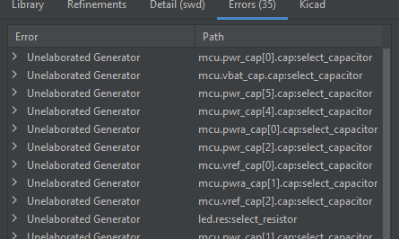

<details>
  <summary>At this point, your code might look like...</summary>

  ```python
  class BlinkyExample(SimpleBoardTop):
    def contents(self) -> None:
      super().contents()
  
      self.mcu = self.Block(Lpc1549_48())
      self.led = self.Block(IndicatorLed())
      self.connect(self.mcu.digital[0], self.led.signal)
      self.connect(self.mcu.gnd, self.led.gnd)
  ```
</details>

### Adding power and programming
_In this section, you'll add and connect a power source (PJ-102A barrel jack) and programming connector (SWD header) to fix errors._

Because we're ultimately writing code, where we insert blocks in the code could matter.
For example, this following code would be illegal because it attempts to reference a block in a `connect` statement before it has been instantiated:

```python
# DON'T DO THIS - THIS WON'T COMPILE
self.mcu = self.Block(Lpc1549_48())
self.connect(self.mcu.gnd, self.jack.gnd)
self.jack = self.Block(Pj_102a())
```

As a general matter of style, blocks that are "upstream" (such as in power flow terms) of others should be instantiated before.
As such, repeat the above add block flow with the **Pj_102a** barrel jack connector (you can search for `BarrelJack`), but with the caret before the microcontroller (since it will power the microcontroller).
Do the same with the **SwdCortexTargetHeader** (you can search for `swd` to find all the SWD connectors), with the caret after the microcontroller (since the microcontroller ends up connecting to a lot of things).

Note that the inserted code for the barrel jack connector also has a, `voltage_out=RangeExpr()`.
In general, the block insertion action will find required parameters (that don't have defaults) of blocks and insert them as arguments for you to fill out.
Here, `RangeExpr()` means this parameter takes a range-valued (think numerical intervals) expression.
Parameter values can only be set in the code editor.
We'll arbitrarily pick **5v ±10%**, so change the line of code to

```python
self.jack = self.Block(Pj_102a(voltage_out=5*Volt(tol=0.10)))
```

Repeat the connection flow with the `swd` and `pwr` lines (making sure to power both the microcontroller and SWD header).

To add additional ports to an existing connection (such as `gnd`), you must start the connect operation with a port in the existing connection.
In this case, if your caret is also in a prior connect statement, the new port is inserted to the prior connect.
Otherwise, a new connect statement is inserted.

> For a `connect` statement, the caret is within the statement if it is within the parentheses.
> The caret is outside if it is immediately after the closing parentheses.

Re-compile, and you should get a lot less errors now.

<details>
  <summary>At this point, your code and diagram might look like...</summary>

  ```python
  class BlinkyExample(SimpleBoardTop):
    def contents(self) -> None:
      super().contents()
      
      self.jack = self.Block(Pj_102a(voltage_out=5*Volt(tol=0.10)))

      self.mcu = self.Block(Lpc1549_48())
      self.swd = self.Block(SwdCortexTargetHeader())
      self.connect(self.swd.swd, self.mcu.swd)

      self.led = self.Block(IndicatorLed())
      self.connect(self.mcu.digital[0], self.led.signal)

      self.connect(self.jack.pwr, self.mcu.pwr, self.swd.pwr)
      self.connect(self.jack.gnd, self.mcu.gnd, self.swd.gnd, self.led.gnd)
  ```

  Note that I've chosen to consolidate all the power and ground connections at the end, instead of having separate `connect` statements for each block.
  In a later section, we'll clean that up using an implicit connect construct.

  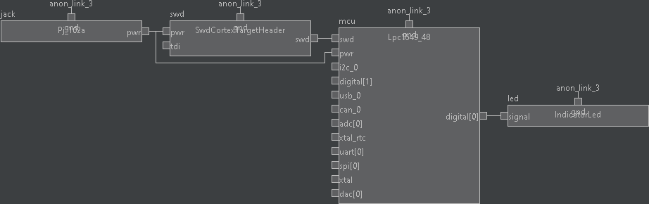  
</details>

### Inspection
However, overvoltage errors remain.
If you mouse over the power connection, you should see the problem:
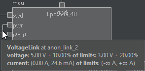

The microcontroller is seeing a 5.0v ±10% voltage on a 3.3v device (technically 2.4-3.6v, rendered as 3.0v ±20%).

### Adding and refining a power converter
_In this section, you'll insert an abstract power converter to fix the prior error, and refine it with a specific part number._

Repeat the add block flow with the abstract **BuckConverter** block.
Remember to select a logical location for insertion.
Similar to the barrel jack, the inserted `BuckConverter` also takes a parameter `output_voltage`.
Let's ask for a **3.3v ±5%** output voltage:

```python
self.buck = self.Block(BuckConverter(output_voltage=3.3*Volt(tol=0.05)))
```

To hook up the converter between the barrel jack and low-voltage components, we'll need to disconnect the barrel jack's power port from the rest of the system.
**Modifications like this need to be done in code**, so find the connect statement where the barrel jack's power port is part of, and remove the barrel jack from that statement.
You do not need to modify the ground connections.

> If you need to locate where a port is connected, you can right click on the port in the block diagram, and use the Goto Connect options.

> If the barrel jack is the only element holding several connect statements together (as if written in a chain), you will need to refactor the HDL so that is no longer the case.
> <details>
>   <summary>For example...</summary>
>   if your code was written like this (which is not stylistically recommended!):
>
>   ```python
>   self.connect(self.mcu.pwr, self.jack.pwr)
>   self.connect(self.jack.pwr, self.swd.pwr)
>   ```
>
>   removing `self.jack.pwr` from both `connect` statements would also disconnect `self.mcu.pwr` from `self.swd.pwr`.
>   Instead, it would need to be refactored to combine the two `connect` statements:
>
>   ```python
> self.connect(self.mcu.pwr, self.swd.pwr)
>   ```
> </details>

Then, refresh the visualization by recompiling, and you can hook up the buck converter via the GUI.

After recompiling with a connected buck converter, you'll still have errors.
The buck converter is still an abstract type (it has no implementation, and hence no output voltage, which confuses everything downstream), so we must give it one.

<details>
  <summary>At this point, your code and diagram might look like...</summary>

  ```python
  class BlinkyExample(SimpleBoardTop):
    def contents(self) -> None:
      super().contents()

      self.jack = self.Block(Pj_102a(voltage_out=5*Volt(tol=0.10)))
  
      self.buck = self.Block(BuckConverter(output_voltage=3.3*Volt(tol=0.05)))
      self.connect(self.jack.pwr, self.buck.pwr_in)
  
      self.mcu = self.Block(Lpc1549_48())
      self.swd = self.Block(SwdCortexTargetHeader())
      self.connect(self.swd.swd, self.mcu.swd)
  
      self.led = self.Block(IndicatorLed())
      self.connect(self.mcu.digital[0], self.led.signal)
  
      self.connect(self.buck.pwr_out, self.mcu.pwr, self.swd.pwr)
      self.connect(self.jack.gnd, self.buck.gnd, self.mcu.gnd, self.swd.gnd, self.led.gnd)
  ```


</details>

Select the buck converter in the block diagram visualization.
Then, search for `Buck` in the library browser, and pick the `Tps561201` under the BuckConverter.
Right click on it, and select Refine Instance to set a refinement for this particular block instance.
The following code should appear in the top-level design in the code editor:

```python
def refinements(self) -> Refinements:
  return super().refinements() + Refinements(
    instance_refinements=[
      (['buck'], Tps561201),
    ]
  )
```

Recompile, and there should be no more errors.

> Abstract types are useful primarily in libraries to preserve alternatives, the refinement of which is left to the top-level designer.
> For example, SimpleBoardTop defines a default set of refinements for 0603 surface-mount components, but because libraries are written with (for example) abstract Resistor classes, you can select a resistor and override it with a through-hole part, such as `AxialResistor`.

> Refine instance refines that one particular block, by its name.
> Refine class refines all blocks of that class.
> 

<details>
  <summary>At this point, your code and diagram might look like...</summary>

  ```python
  class BlinkyExample(SimpleBoardTop):
    def contents(self) -> None:
      super().contents()
  
      self.jack = self.Block(Pj_102a(voltage_out=6*Volt(tol=0.10)))
  
      self.buck = self.Block(BuckConverter(output_voltage=3.3*Volt(tol=0.05)))
      self.connect(self.jack.pwr, self.buck.pwr_in)
  
      self.mcu = self.Block(Lpc1549_48())
      self.swd = self.Block(SwdCortexTargetHeader())
      self.connect(self.swd.swd, self.mcu.swd)
  
      self.led = self.Block(IndicatorLed())
      self.connect(self.mcu.digital[0], self.led.signal)
  
      self.connect(self.mcu.pwr, self.swd.pwr, self.buck.pwr_out)
      self.connect(self.jack.gnd, self.buck.gnd, self.mcu.gnd, self.swd.gnd, self.led.gnd)
  
  def refinements(self) -> Refinements:
    return super().refinements() + Refinements(
      instance_refinements=[
        (['buck'], Tps561201),
      ])
  ```

  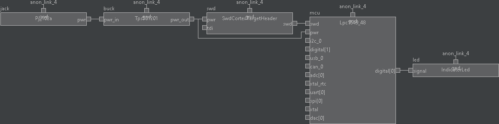
</details>

### Navigation
If you hover your mouse over the output line, you can see that it is now at 3.3v ±4.47%.
Why?
You can navigate into the Tps561201 by double-blocking on it.

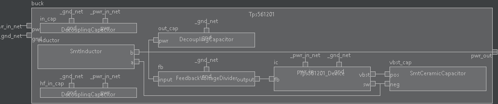

You can see that it generated a feedback voltage divider, and if you mouseover the block, you can see that it generated a resistive divider with ratio of 0.23.
If you go into the voltage divider block and mouseover the resistors, you can also see resistor values selected, 10k and 33k.
The output voltage on the output line reflects the actual expected output voltage, accounting for resistor tolerance and the chip's feedback reference tolerance.

To zoom out, you can double-click on the topmost block.
Or, double-click on any block in the design tree to zoom to that block.

You can see details of some other components (like capacitor capacitance, or inductor inductance) by mouseover as well:

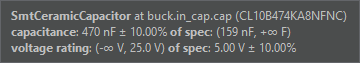

If you want to see how the buck converter block (or any block) was implemented, you can also right click the block, and select "Goto Definition".

### Advanced: arraying LEDs
_In this section, you'll modify the GUI-inserted code to programmatically create an array of LEDs._

> In general, code offers you a lot more flexibility and power than can be achieved through the GUI.
> If you looked at the buck converter code, it automatically sizes the internal components (inductors, capacitors) based on standard design equations.
> This functionality is probably more useful in those library components, but can also come in handy in some cases in the top-level design. 

Since the circuit is "constructed" by executing Python code, we can actually write arbitrary Python to generate hardware.
Take your LED instantiation and connection code, and move the lines together:

```python
self.led = self.Block(IndicatorLed())
self.connect(self.mcu.digital[0], self.led.signal)
self.connect(self.mcu.gnd, self.led.gnd)
```

Declare `led` to be an array by adding:

```python
self.led = ElementDict()
```

and refactor the actual LED instantiation and connection by wrapping everything in a `for`-loop:

```python
self.led = ElementDict()
for i in range(4):
  self.led[i] = self.Block(IndicatorLed())
  self.connect(self.mcu.digital[i], self.led[i].signal)
  self.connect(self.mcu.gnd, self.led[i].gnd)
```

> As a general note, note that HDLs have different non-functional degrees of freedom compared to schematic.
> In HDL, the style (including ordering) of hardware construction statements is somewhat like the placement and arrangement of symbols and nets in a graphical schematic.
> While the block diagram visualization is automatically generated, the style of the code can impact readability and maintainability.
> 
> While GUI operations are useful in writing lines of code, it is up to you to determine where they should be placed to keep the HDL readable.
> We'll do a bit of light cleanup in the next section using advanced constructs.


## Syntactic sugar

_Syntactic sugar refers to syntax within programming languages that makes things more usable._
_In this section, we clean up the prior example by consolidating some repetitive connections through implicit scopes._

> The IDE does not provide any special support or understanding for these operations, but will render the final outcome.

Because some connections (like power and ground) are very common, the HDL provides the idea of an implicit connection scope to automatically make them when a block is instantiated.
In our example, if we wanted to create a scope with an implicit power connection from the buck converter output, and an implicit ground connection from the barrel jack input, we can write:

```python
with self.implicit_connect(
    ImplicitConnect(self.buck.pwr_out, [Power]),
    ImplicitConnect(self.jack.gnd, [Common]),
) as imp:
  ...
```

_Because this uses `self.buck` and `self.jack` (or however you named those components), those must be declared in code before they can be referenced._

This creates an implicit connection scope `imp`, with two `ImplicitConnect` rules:
- The first connecting all ports with the tag `Power` to `self.buck.pwr_out`
- The second connecting all ports with the tag `Common` to `self.jack.gnd`

When blocks define ports, they can associate tags with them to specify implicit connectivity.
To prevent errors, all ports with tags are required to be connected, either implicitly (as in this section) or explicitly (through `connect` statements).
`Power` (for a general positive voltage rail) and `Common` (for ground) are the most common tags. 

If we move the microcontroller, SWD port, and LED instantiations inside this scope, we no longer need to have connect statements for their power and ground ports.
_Note the use of `imp.Block(...)` instead of `self.Block(...)`!_

```python
  self.mcu = imp.Block(Lpc1549_48())
  self.swd = imp.Block(SwdCortexTargetHeader())
  
  self.led = imp.Block(IndicatorLed())
```

Note that we still have to make the connections for the SWD interface and the LED signal.
Those do not need to be placed in the implicit scope, but may be for stylistic purposes. 

There also exists a chain connect that allows a block instantiation and connection on one line, but as this tutorial focuses on the IDE, we'll skip that.
If you're interested, the HDL getting started doc has [a section on chain connects](PolymorphicBlocks/getting-started.md#chain-connects).
Chain also makes use of the `Input`, `Output`, and `InOut` tags.

### Wrapping up
At this point, the complete and refactored HDL might look something like this:

```python
class BlinkyExample(SimpleBoardTop):
  def contents(self) -> None:
    super().contents()

    self.jack = self.Block(Pj_102a(voltage_out=5*Volt(tol=0.1)))
    self.buck = self.Block(BuckConverter(output_voltage=3.3*Volt(tol=0.05)))
    self.connect(self.jack.pwr, self.buck.pwr_in)
    self.connect(self.jack.gnd, self.buck.gnd)

    with self.implicit_connect(
        ImplicitConnect(self.buck.pwr_out, [Power]),
        ImplicitConnect(self.jack.gnd, [Common]),
    ) as imp:
      self.mcu = imp.Block(Lpc1549_48())
      self.swd = imp.Block(SwdCortexTargetHeader())
      self.connect(self.swd.swd, self.mcu.swd)

      self.led = ElementDict()
      for i in range(4):
        self.led[i] = imp.Block(IndicatorLed())
        self.connect(self.mcu.digital[i], self.led[i].signal)

  def refinements(self) -> Refinements:
    return super().refinements() + Refinements(
    instance_refinements=[
      (['buck'], Tps561201),
    ])
```


## Advanced tutorial: making parts

_In this section, we build and add a digital magnetic field sensor ([LF21215TMR](https://www.littelfuse.com/~/media/electronics/datasheets/magnetic_sensors_and_reed_switches/littelfuse_tmr_switch_lf21215tmr_datasheet.pdf.pdf)) to our design._
_We do this in two stages, first defining a `FootprintBlock` for the chip itself, then building the wrapper application circuit `Block` around it._

> While `Block`s are arbitrary hierarchy blocks that only have ports, inner blocks, and connections, `FootprintBlock` also allows up to one PCB footprint, and a mapping from the block ports to footprint pins.
> You can loosely think of `FootprintBlock` as analogous to a schematic symbol, while `Block` is closer to a hierarchy sheet.

### Creating a part
A new block can be defined from the library browser.
Since we will be making a `FootprintBlock`, search for that in the library browser.
Then, select a point for insertion (top-level: outside any class or function) in the file being edited, right-click on FootprintBlock, and select Define New Subclass.
It should insert this code:

```python
class Lf21215tmr_Device(FootprintBlock):
  def __init__(self) -> None:
    super().__init__()
    # block boundary (ports, parameters) definition here 

  def contents(self) -> None:
    super().contents()
    # block implementation (subblocks, internal connections, footprint) here
```

> `__init__` is meant to define the interface of a block (all Ports and Parameters), while `contents` is meant to define the contents of a block (largely Blocks, connections, and constraints).
> This split is not enforced (and there are cases where it is desirable to mix them into just `__init__`), but the main benefits of this are performance (avoid building the full design tree unnecessarily) and separation for readability.

To work with this part in the visual editor, you can instantiate this block in your top-level design.
Once you recompile, it should show up in the library browser.
Then, double-click into the newly created `Lf21215tmr_Device` block to set it for editing.

The chip itself has three ports: Vcc (voltage input, type **VoltageSink**), GND (voltage input, type **VoltageSink**), and Vout (digital output, type **DigitalSource**).
We can create ports through the library browser, by searching for the port name, then double-clicking to insert.
Ports show up at the end of the library browser, and can only be inserted with the caret in `__init__` (because it defines the block's interface).

We will need to modify these with the appropriate parameters from the datasheet: operating supply voltage of 1.8-5.5v, supply current of 1.5uA (nominal), and output thresholds of 0.2v (low) and (Vcc-0.3) (high).

Replace the `voltage_limits` and `current_draw` for Vcc accordingly:
```python
self.vcc = self.Port(
  VoltageSink(voltage_limits=(1.8, 5.5)*Volt, current_draw=(0, 1.5)*uAmp))
```

For `gnd`, we have a special `Ground()` wrapper:
```python
self.gnd = self.Port(Ground())
```

For `DigitalSource`, while we could write the parameters explicitly:
```python
self.vout = self.Port(DigitalSource(
  voltage_out=(self.gnd.link().voltage.lower(),
               self.vcc.link().voltage.upper()),
  current_limits=1.5 * uAmp(tol=0),
  output_thresholds=(self.gnd.link().voltage.upper() + 0.2 * Volt,
                     self.vcc.link().voltage.lower() - 0.3 * Volt)
))
```

there's also a wrapper `DigitalSource.from_supply` that wraps the common way of specifying a digital output as offsets from voltage rails:
```python
self.vout = self.Port(DigitalSource.from_supply(
  self.gnd, self.vcc,
  output_threshold_offset=(0.2, -0.3)
))
```

> With a relatively simple example like this, you may be wondering why this needs an HDL instead of a ports with property grid interface that supports mathematical expressions.
> That interface would have a few shortcomings:
> - First, as seen with `DigitalSource.from_supply`, it would be less straightforward to support these simple wrappers for common cases.
>   While possible, these wrappers would also likely be baked into the tool (and limited to what the tool designers support), instead of being user-defineable.
> - Second, interfaces that don't allow multi-line code (think spreadsheets) generally have issues with duplication for re-use.
>   While this example only had one port, consider if we had several outputs with the same electrical characteristics.
>   In code, we could define one port model and instantiate it multiple times, while the GUI equivalent is trickier.

### Defining the footprint
`FootprintBlock` defines its footprint and pin mapping (from port to footprint pin) via a `self.footprint(...)` call.
This can be inserted from the GUI.

Select (but without necessarily focusing into) the newly created block in the GUI.
Then, position the caret at where you want to insert the code in the class definition (you can also navigate to the class definition through the block's right-click menu) . 
In the KiCad panel, search for a **SOT-23** footprint, and double-click to insert code. 
This code should appear:

```python
self.footprint(
  'U', 'Package_TO_SOT_SMD:SOT-23',
  { },
  mfr='', part='',
  datasheet=''
)
```

> If your caret is already inside a `self.footprint` call, it will instead modify the existing call to use the selected footprint.  

> This section isn't yet implemented. Copypaste into the curly braces
> ```python
>   '1': self.vcc,
>   '3': self.gnd,
>   '2': self.vout,
> ``` 

To assign pins, double-click on the relevant pad on the footprint while the caret is within a `self.footprint` call.
Then, select from the list of connectable pins.

Assign these pins:
- Pin 1: `vcc`
- Pin 2: `vout`
- Pin 3: `gnd`

You can also fill in the other fields in the code (which would be propagated to BoMs and layout):
- Manufacturer: `Littelfuse`
- Part: `LF21215TMR`
- Datasheet: `https://www.littelfuse.com/~/media/electronics/datasheets/magnetic_sensors_and_reed_switches/littelfuse_tmr_switch_lf21215tmr_datasheet.pdf.pdf`

The complete code looks like:

```python
self.footprint(
  'U', 'Package_TO_SOT_SMD:SOT-23',
  {
    '1': self.vcc,
    '2': self.vout,
    '3': self.gnd,
  },
  mfr='Littelfuse', part='LF21215TMR',
  datasheet='https://www.littelfuse.com/~/media/electronics/datasheets/magnetic_sensors_and_reed_switches/littelfuse_tmr_switch_lf21215tmr_datasheet.pdf.pdf'
)
```

### Creating the application circuit
In most cases, individual components are not used alone but are instal part of an application circuit,
As in the typical application circuit of the LF21215TMR datasheet, it requires a 0.1uF decoupling capacitor.
We will build the application circuit as a block around the device defined above, then use this in the top-level design.

Again, start by creating a new block:
```python
class Lf21215tmr(Block):
  def __init__(self) -> None:
    super().__init__()
    # block boundary (ports, parameters) definition here 

  def contents(self) -> None:
    super().contents()
    # block implementation (subblocks, internal connections, footprint) here
```

Note that in contrast to the previous one, this drops the `_Device` prefix (which is purely stylistic) and also extends `Block` instead of `FootprintBlock`.

Again, if you want to work with this in the graphical editor, you can recompile once you've added the block code, then instantiate it from the library browser.
If you had the `Lf21215tmr_Device` block in your top-level design, you can delete that. 
Then, double-click into the newly created `Lf21215tmr` block to set it for editing.

<!-- TODO GUI Export support -->

<!-- TODO Create Wrapper Block? -->

As indicated by the application circuit, this block would have the same ports as the device (two **VoltageSink** and one **DigitalSource**). It would have two parts, the `Lf21215tmr_Device` we just defined, and a `DecouplingCapacitor`.
Instantiate them both, and connect them together.

For the ports, because these are intermediate ports, they do not need parameters (they are derived from the connected devices), so you can delete all of them.
You can also add the implicit connection `Power` and `Common` tags
```python
self.pwr = self.Port(VoltageSink(), [Power])
self.gnd = self.Port(VoltageSink(), [Common])
self.out = self.Port(DigitalSource())
```

For the DecouplingCapacitor, you'll need to specify it as 0.1uF.
By default, we use a loose 20% tolerance for capacitors:
```python
self.cap = self.Block(DecouplingCapacitor(capacitance=0.1*uFarad(tol=0.2)))
```

### Export
Instead of creating ports, we can also use the `self.Export(...)` function to export an inner port directly.
The main benefit is you don't need to specify repeated type information for the port, which will be inferred from the inner port.

With this style, `__init__` can be rewritten as follows:
```python
self.ic = self.Block(Lf21215tmr_Device())
self.pwr = self.Export(self.ic.vcc, [Power])
self.gnd = self.Export(self.ic.gnd, [Common])
self.out = self.Export(self.ic.vout)

self.cap = self.Block(DecouplingCapacitor(capacitance=0.1*uFarad(tol=0.2)))
self.connect(self.cap.pwr, self.pwr)
self.connect(self.cap.gnd, self.gnd)
```

### Finishing Touches
Connect things at the top level (if you haven't done so already), and we're done!
